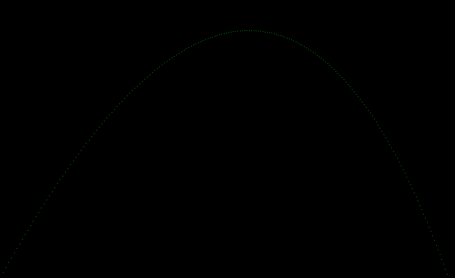

# Ray tracer

Here goes the code generated while following the book The Ray Tracer Challenge using golang.

## Currently at chapter 2

I just finished chapter two and produced this image that portrays the trajectory of a projectile

